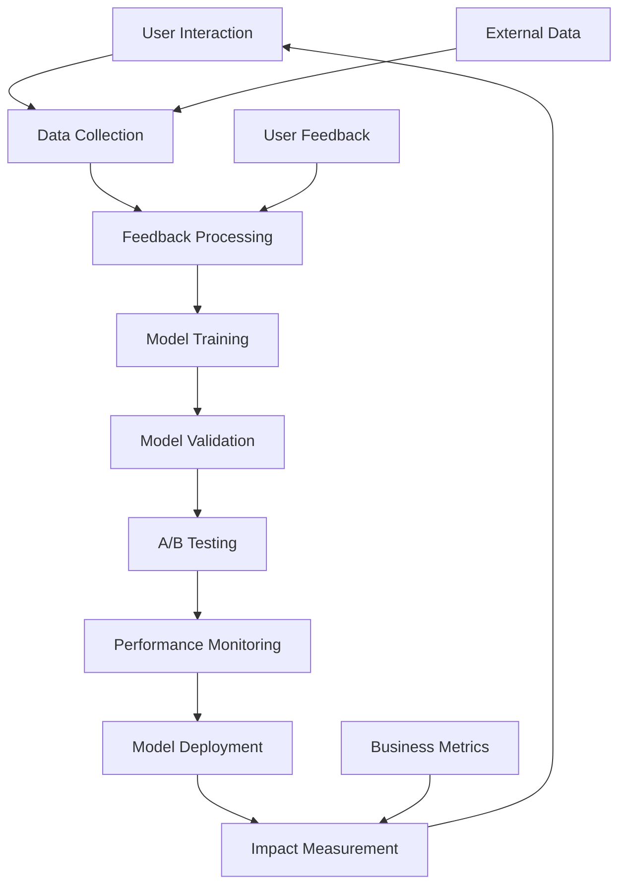

# 🧠 IBIAS AI Learning Loop Design

**Document:** AI Learning Loop Architecture & Implementation  
**Version:** 2.0 Enhanced  
**Purpose:** Continuous AI Model Improvement & Optimization  
**Last Updated:** 2024

---

## 🎯 Learning Loop Philosophy

**"Every Interaction Teaches, Every Decision Improves"**

The IBIAS AI Learning Loop is designed to create a self-improving system that:
- 📊 **Learns from Every User Interaction**
- 🎯 **Adapts to Business Context**
- 🔄 **Continuously Optimizes Performance**
- 📈 **Measures Real Business Impact**
- 🛡️ **Maintains Privacy and Security**

---

## 🏗️ Learning Loop Architecture



---

## 📊 Data Collection Framework

### 1. Implicit Feedback Collection

**User Behavior Tracking:**
```typescript
interface UserInteraction {
  userId: string;
  sessionId: string;
  timestamp: Date;
  action: InteractionType;
  context: BusinessContext;
  outcome: InteractionOutcome;
  confidence: number;
}

enum InteractionType {
  RECOMMENDATION_VIEW = 'recommendation_view',
  RECOMMENDATION_CLICK = 'recommendation_click',
  RECOMMENDATION_IMPLEMENT = 'recommendation_implement',
  DASHBOARD_VIEW = 'dashboard_view',
  QUERY_EXECUTE = 'query_execute',
  REPORT_GENERATE = 'report_generate',
  ALERT_ACKNOWLEDGE = 'alert_acknowledge',
  TASK_COMPLETE = 'task_complete'
}
```

**Business Context Capture:**
```typescript
interface BusinessContext {
  companyId: string;
  industry: string;
  companySize: CompanySize;
  seasonality: SeasonalityPattern;
  currentMetrics: BusinessMetrics;
  historicalTrends: TrendData[];
  competitivePosition: MarketPosition;
}
```

### 2. Explicit Feedback Collection

**Recommendation Feedback:**
- ⭐ **Rating System:** 1-5 stars with contextual reasons
- 👍 **Quick Actions:** Thumbs up/down with optional comments
- 📝 **Detailed Feedback:** Structured feedback forms
- 📊 **Impact Reporting:** Business outcome tracking

**Feedback Collection UI:**
```typescript
interface FeedbackRequest {
  recommendationId: string;
  rating: number; // 1-5
  relevance: number; // 1-5
  clarity: number; // 1-5
  actionability: number; // 1-5
  implementationDifficulty: number; // 1-5
  expectedImpact: ImpactLevel;
  actualImpact?: ImpactLevel;
  comments?: string;
  implementationStatus: ImplementationStatus;
}
```

### 3. Business Outcome Tracking

**Success Metrics:**
```typescript
interface BusinessOutcome {
  recommendationId: string;
  implementationDate: Date;
  measurementPeriod: DateRange;
  baselineMetrics: BusinessMetrics;
  postImplementationMetrics: BusinessMetrics;
  attributedImpact: ImpactMeasurement;
  confidenceLevel: number;
}

interface ImpactMeasurement {
  revenueImpact: number;
  costSavings: number;
  efficiencyGain: number;
  customerSatisfactionChange: number;
  timeToValue: number;
}
```

---

## 🔄 Feedback Processing Pipeline

### 1. Data Validation & Cleaning

**Quality Assurance:**
```typescript
class FeedbackProcessor {
  async validateFeedback(feedback: RawFeedback): Promise<ValidatedFeedback> {
    // Remove outliers and spam
    const cleaned = this.removeOutliers(feedback);
    
    // Validate business context
    const contextValidated = await this.validateContext(cleaned);
    
    // Normalize ratings and scores
    const normalized = this.normalizeScores(contextValidated);
    
    // Enrich with additional context
    return this.enrichContext(normalized);
  }
  
  private removeOutliers(feedback: RawFeedback): CleanedFeedback {
    // Statistical outlier detection
    // Spam and bot detection
    // Consistency validation
  }
}
```

### 2. Sentiment & Intent Analysis

**Natural Language Processing:**
```typescript
interface FeedbackAnalysis {
  sentiment: SentimentScore;
  intent: UserIntent;
  topics: ExtractedTopic[];
  urgency: UrgencyLevel;
  actionableInsights: ActionableInsight[];
}

class FeedbackAnalyzer {
  async analyzeFeedback(feedback: string): Promise<FeedbackAnalysis> {
    const sentiment = await this.analyzeSentiment(feedback);
    const intent = await this.extractIntent(feedback);
    const topics = await this.extractTopics(feedback);
    const urgency = this.assessUrgency(feedback, sentiment);
    const insights = await this.generateInsights(feedback, topics);
    
    return { sentiment, intent, topics, urgency, insights };
  }
}
```

### 3. Pattern Recognition

**Trend Identification:**
```typescript
class PatternRecognizer {
  async identifyPatterns(feedbackHistory: FeedbackData[]): Promise<Pattern[]> {
    const patterns = [];
    
    // Temporal patterns
    patterns.push(...this.findTemporalPatterns(feedbackHistory));
    
    // User segment patterns
    patterns.push(...this.findSegmentPatterns(feedbackHistory));
    
    // Feature usage patterns
    patterns.push(...this.findUsagePatterns(feedbackHistory));
    
    // Performance correlation patterns
    patterns.push(...this.findPerformancePatterns(feedbackHistory));
    
    return patterns;
  }
}
```

---

## 🎯 Model Training & Optimization

### 1. Recommendation Model Training

**Multi-Objective Optimization:**
```typescript
interface TrainingObjectives {
  accuracy: number; // Weight: 0.3
  relevance: number; // Weight: 0.25
  businessImpact: number; // Weight: 0.25
  userSatisfaction: number; // Weight: 0.2
}

class RecommendationTrainer {
  async trainModel(trainingData: TrainingDataset): Promise<TrainedModel> {
    // Feature engineering
    const features = await this.engineerFeatures(trainingData);
    
    // Multi-objective optimization
    const objectives = this.defineObjectives();
    
    // Model training with cross-validation
    const model = await this.trainWithCrossValidation(features, objectives);
    
    // Hyperparameter optimization
    const optimizedModel = await this.optimizeHyperparameters(model);
    
    return optimizedModel;
  }
}
```

### 2. Personalization Engine

**User-Specific Adaptation:**
```typescript
class PersonalizationEngine {
  async personalizeRecommendations(
    baseRecommendations: Recommendation[],
    userProfile: UserProfile,
    businessContext: BusinessContext
  ): Promise<PersonalizedRecommendation[]> {
    
    // User preference learning
    const preferences = await this.learnUserPreferences(userProfile);
    
    // Business context adaptation
    const contextualFactors = this.analyzeBusinessContext(businessContext);
    
    // Recommendation ranking
    const rankedRecommendations = this.rankRecommendations(
      baseRecommendations,
      preferences,
      contextualFactors
    );
    
    return rankedRecommendations;
  }
}
```

### 3. Continuous Learning Pipeline

**Real-Time Model Updates:**
```typescript
class ContinuousLearner {
  async updateModels(newFeedback: FeedbackBatch): Promise<ModelUpdateResult> {
    // Incremental learning
    const incrementalUpdate = await this.incrementalTrain(newFeedback);
    
    // Online learning for real-time adaptation
    const onlineUpdate = await this.onlineLearning(newFeedback);
    
    // Ensemble model updates
    const ensembleUpdate = await this.updateEnsemble(incrementalUpdate, onlineUpdate);
    
    // Validation and deployment
    const validationResult = await this.validateUpdate(ensembleUpdate);
    
    if (validationResult.isValid) {
      await this.deployUpdate(ensembleUpdate);
    }
    
    return {
      updateApplied: validationResult.isValid,
      performanceImprovement: validationResult.improvement,
      confidence: validationResult.confidence
    };
  }
}
```

---

## 🧪 A/B Testing Framework

### 1. Experiment Design

**Multi-Armed Bandit Testing:**
```typescript
interface ExperimentConfig {
  experimentId: string;
  name: string;
  description: string;
  variants: ExperimentVariant[];
  trafficAllocation: TrafficAllocation;
  successMetrics: SuccessMetric[];
  duration: Duration;
  minimumSampleSize: number;
}

class ABTestManager {
  async createExperiment(config: ExperimentConfig): Promise<Experiment> {
    // Statistical power analysis
    const powerAnalysis = this.calculatePowerAnalysis(config);
    
    // Traffic allocation optimization
    const optimizedAllocation = this.optimizeTrafficAllocation(config);
    
    // Experiment setup
    const experiment = await this.setupExperiment({
      ...config,
      trafficAllocation: optimizedAllocation,
      requiredSampleSize: powerAnalysis.sampleSize
    });
    
    return experiment;
  }
}
```

### 2. Dynamic Traffic Allocation

**Thompson Sampling:**
```typescript
class DynamicAllocation {
  async allocateTraffic(
    experiment: Experiment,
    currentResults: ExperimentResults
  ): Promise<TrafficAllocation> {
    
    // Thompson sampling for exploration vs exploitation
    const sampledRewards = this.sampleRewards(currentResults);
    
    // Calculate optimal allocation
    const optimalAllocation = this.calculateOptimalAllocation(sampledRewards);
    
    // Apply safety constraints
    const safeAllocation = this.applySafetyConstraints(optimalAllocation);
    
    return safeAllocation;
  }
}
```

### 3. Statistical Analysis

**Bayesian Analysis:**
```typescript
class StatisticalAnalyzer {
  async analyzeResults(experiment: Experiment): Promise<AnalysisResult> {
    // Bayesian statistical analysis
    const bayesianResult = await this.bayesianAnalysis(experiment);
    
    // Multiple comparison correction
    const correctedResult = this.correctMultipleComparisons(bayesianResult);
    
    // Effect size calculation
    const effectSize = this.calculateEffectSize(correctedResult);
    
    // Confidence intervals
    const confidenceIntervals = this.calculateConfidenceIntervals(correctedResult);
    
    return {
      significance: correctedResult.significance,
      effectSize,
      confidenceIntervals,
      recommendation: this.generateRecommendation(correctedResult)
    };
  }
}
```

---

## 📊 Performance Monitoring

### 1. Real-Time Metrics

**Model Performance Dashboard:**
```typescript
interface ModelMetrics {
  accuracy: number;
  precision: number;
  recall: number;
  f1Score: number;
  auc: number;
  businessImpact: BusinessImpactMetrics;
  userSatisfaction: SatisfactionMetrics;
  latency: LatencyMetrics;
  throughput: ThroughputMetrics;
}

class MetricsCollector {
  async collectMetrics(timeRange: TimeRange): Promise<ModelMetrics> {
    const predictions = await this.getPredictions(timeRange);
    const actualOutcomes = await this.getActualOutcomes(timeRange);
    const userFeedback = await this.getUserFeedback(timeRange);
    
    return {
      accuracy: this.calculateAccuracy(predictions, actualOutcomes),
      precision: this.calculatePrecision(predictions, actualOutcomes),
      recall: this.calculateRecall(predictions, actualOutcomes),
      f1Score: this.calculateF1Score(predictions, actualOutcomes),
      auc: this.calculateAUC(predictions, actualOutcomes),
      businessImpact: this.calculateBusinessImpact(predictions, actualOutcomes),
      userSatisfaction: this.calculateSatisfaction(userFeedback),
      latency: this.calculateLatency(predictions),
      throughput: this.calculateThroughput(predictions)
    };
  }
}
```

### 2. Drift Detection

**Data & Concept Drift Monitoring:**
```typescript
class DriftDetector {
  async detectDrift(
    currentData: DataSample[],
    referenceData: DataSample[]
  ): Promise<DriftDetectionResult> {
    
    // Statistical drift tests
    const statisticalDrift = await this.detectStatisticalDrift(currentData, referenceData);
    
    // Distribution drift
    const distributionDrift = await this.detectDistributionDrift(currentData, referenceData);
    
    // Performance drift
    const performanceDrift = await this.detectPerformanceDrift(currentData, referenceData);
    
    // Concept drift
    const conceptDrift = await this.detectConceptDrift(currentData, referenceData);
    
    return {
      hasDrift: this.aggregateDriftSignals([statisticalDrift, distributionDrift, performanceDrift, conceptDrift]),
      driftType: this.identifyDriftType([statisticalDrift, distributionDrift, performanceDrift, conceptDrift]),
      severity: this.calculateDriftSeverity([statisticalDrift, distributionDrift, performanceDrift, conceptDrift]),
      recommendation: this.generateDriftRecommendation([statisticalDrift, distributionDrift, performanceDrift, conceptDrift])
    };
  }
}
```

### 3. Automated Alerts

**Intelligent Alerting System:**
```typescript
class AlertManager {
  async processMetrics(metrics: ModelMetrics): Promise<Alert[]> {
    const alerts: Alert[] = [];
    
    // Performance degradation alerts
    if (metrics.accuracy < this.thresholds.minAccuracy) {
      alerts.push(this.createPerformanceAlert(metrics));
    }
    
    // Business impact alerts
    if (metrics.businessImpact.revenue < this.thresholds.minRevenue) {
      alerts.push(this.createBusinessImpactAlert(metrics));
    }
    
    // User satisfaction alerts
    if (metrics.userSatisfaction.averageRating < this.thresholds.minSatisfaction) {
      alerts.push(this.createSatisfactionAlert(metrics));
    }
    
    // Latency alerts
    if (metrics.latency.p95 > this.thresholds.maxLatency) {
      alerts.push(this.createLatencyAlert(metrics));
    }
    
    return alerts;
  }
}
```

---

## 🔄 Feedback Loop Optimization

### 1. Feedback Quality Enhancement

**Smart Feedback Collection:**
```typescript
class FeedbackOptimizer {
  async optimizeFeedbackCollection(
    user: User,
    context: InteractionContext
  ): Promise<FeedbackStrategy> {
    
    // User engagement analysis
    const engagement = await this.analyzeUserEngagement(user);
    
    // Optimal timing prediction
    const optimalTiming = await this.predictOptimalTiming(user, context);
    
    // Feedback method selection
    const optimalMethod = await this.selectFeedbackMethod(user, engagement);
    
    // Incentive optimization
    const incentives = await this.optimizeIncentives(user, engagement);
    
    return {
      timing: optimalTiming,
      method: optimalMethod,
      incentives,
      expectedResponseRate: this.predictResponseRate(optimalTiming, optimalMethod, incentives)
    };
  }
}
```

### 2. Learning Rate Optimization

**Adaptive Learning Rates:**
```typescript
class LearningRateOptimizer {
  async optimizeLearningRate(
    modelPerformance: ModelPerformance,
    feedbackVolume: FeedbackVolume,
    businessContext: BusinessContext
  ): Promise<LearningRateConfig> {
    
    // Performance-based adjustment
    const performanceAdjustment = this.calculatePerformanceAdjustment(modelPerformance);
    
    // Volume-based adjustment
    const volumeAdjustment = this.calculateVolumeAdjustment(feedbackVolume);
    
    // Context-based adjustment
    const contextAdjustment = this.calculateContextAdjustment(businessContext);
    
    // Combine adjustments
    const optimalRate = this.combineAdjustments([
      performanceAdjustment,
      volumeAdjustment,
      contextAdjustment
    ]);
    
    return {
      learningRate: optimalRate,
      adaptationStrategy: this.selectAdaptationStrategy(optimalRate),
      updateFrequency: this.calculateUpdateFrequency(optimalRate)
    };
  }
}
```

### 3. Multi-Modal Learning

**Cross-Modal Knowledge Transfer:**
```typescript
class MultiModalLearner {
  async transferKnowledge(
    sourceModels: AIModel[],
    targetDomain: BusinessDomain,
    transferStrategy: TransferStrategy
  ): Promise<TransferResult> {
    
    // Domain similarity analysis
    const similarity = await this.analyzeDomainSimilarity(sourceModels, targetDomain);
    
    // Knowledge extraction
    const extractedKnowledge = await this.extractKnowledge(sourceModels, similarity);
    
    // Knowledge adaptation
    const adaptedKnowledge = await this.adaptKnowledge(extractedKnowledge, targetDomain);
    
    // Transfer validation
    const validationResult = await this.validateTransfer(adaptedKnowledge, targetDomain);
    
    return {
      transferSuccess: validationResult.isSuccessful,
      performanceImprovement: validationResult.improvement,
      adaptedModel: validationResult.model
    };
  }
}
```

---

## 🛡️ Privacy & Security

### 1. Privacy-Preserving Learning

**Differential Privacy:**
```typescript
class PrivacyPreservingLearner {
  async trainWithPrivacy(
    trainingData: SensitiveData[],
    privacyBudget: PrivacyBudget
  ): Promise<PrivateModel> {
    
    // Differential privacy mechanism
    const noisyData = this.addDifferentialPrivacyNoise(trainingData, privacyBudget);
    
    // Federated learning setup
    const federatedSetup = await this.setupFederatedLearning(noisyData);
    
    // Secure aggregation
    const aggregatedModel = await this.secureAggregation(federatedSetup);
    
    // Privacy validation
    const privacyValidation = await this.validatePrivacy(aggregatedModel, privacyBudget);
    
    return {
      model: aggregatedModel,
      privacyGuarantees: privacyValidation.guarantees,
      utilityPreservation: privacyValidation.utility
    };
  }
}
```

### 2. Secure Feedback Handling

**End-to-End Encryption:**
```typescript
class SecureFeedbackHandler {
  async processFeedbackSecurely(
    encryptedFeedback: EncryptedFeedback,
    userKeys: UserKeys
  ): Promise<ProcessedFeedback> {
    
    // Decrypt feedback
    const decryptedFeedback = await this.decryptFeedback(encryptedFeedback, userKeys);
    
    // Anonymize sensitive data
    const anonymizedFeedback = this.anonymizeFeedback(decryptedFeedback);
    
    // Process anonymized feedback
    const processedFeedback = await this.processFeedback(anonymizedFeedback);
    
    // Re-encrypt results
    const encryptedResults = await this.encryptResults(processedFeedback, userKeys);
    
    return encryptedResults;
  }
}
```

---

## 📈 Business Impact Measurement

### 1. ROI Calculation

**AI Investment Return:**
```typescript
interface AIROIMetrics {
  implementationCost: number;
  operationalCost: number;
  revenueIncrease: number;
  costSavings: number;
  efficiencyGains: number;
  customerSatisfactionImprovement: number;
  timeToValue: number;
  roi: number;
  paybackPeriod: number;
}

class ROICalculator {
  async calculateAIROI(
    aiImplementation: AIImplementation,
    businessMetrics: BusinessMetrics,
    timeframe: TimeRange
  ): Promise<AIROIMetrics> {
    
    // Cost calculation
    const costs = await this.calculateTotalCosts(aiImplementation, timeframe);
    
    // Benefit calculation
    const benefits = await this.calculateTotalBenefits(businessMetrics, timeframe);
    
    // ROI calculation
    const roi = this.calculateROI(benefits, costs);
    
    // Payback period
    const paybackPeriod = this.calculatePaybackPeriod(benefits, costs);
    
    return {
      ...costs,
      ...benefits,
      roi,
      paybackPeriod
    };
  }
}
```

### 2. Long-term Value Tracking

**Longitudinal Impact Analysis:**
```typescript
class LongTermTracker {
  async trackLongTermImpact(
    recommendations: Recommendation[],
    implementationHistory: ImplementationHistory[],
    businessOutcomes: BusinessOutcome[]
  ): Promise<LongTermImpact> {
    
    // Cohort analysis
    const cohortAnalysis = await this.performCohortAnalysis(
      recommendations,
      implementationHistory,
      businessOutcomes
    );
    
    // Trend analysis
    const trendAnalysis = await this.analyzeTrends(
      businessOutcomes,
      this.timeWindows
    );
    
    // Attribution modeling
    const attribution = await this.attributeImpact(
      recommendations,
      businessOutcomes
    );
    
    return {
      cohortInsights: cohortAnalysis,
      trendInsights: trendAnalysis,
      attributionModel: attribution,
      projectedValue: this.projectFutureValue(trendAnalysis)
    };
  }
}
```

---

## 🔧 Implementation Guidelines

### 1. Development Phases

**Phase 1: Foundation (Weeks 1-4)**
- Basic feedback collection infrastructure
- Simple rating and comment system
- Initial data pipeline setup
- Basic analytics dashboard

**Phase 2: Intelligence (Weeks 5-8)**
- Advanced feedback analysis
- Pattern recognition implementation
- A/B testing framework
- Performance monitoring

**Phase 3: Optimization (Weeks 9-12)**
- Continuous learning pipeline
- Personalization engine
- Advanced analytics
- Privacy-preserving mechanisms

**Phase 4: Scale (Weeks 13-16)**
- Real-time processing
- Multi-modal learning
- Advanced security features
- Enterprise-grade monitoring

### 2. Technical Requirements

**Infrastructure:**
- Real-time data streaming (Apache Kafka)
- Machine learning pipeline (MLflow)
- A/B testing platform (custom)
- Monitoring and alerting (Prometheus + Grafana)

**Security:**
- End-to-end encryption
- Differential privacy
- Secure multi-party computation
- Zero-knowledge proofs

**Performance:**
- Sub-100ms feedback processing
- Real-time model updates
- 99.9% system availability
- Horizontal scalability

### 3. Success Metrics

**Technical Metrics:**
- Model accuracy improvement: >5% quarterly
- Feedback response rate: >60%
- System latency: <100ms
- Uptime: >99.9%

**Business Metrics:**
- User satisfaction: >4.5/5
- Recommendation adoption: >70%
- Business impact: >20% revenue increase
- Customer retention: >95%

---

## 🚀 Future Enhancements

### 1. Advanced AI Techniques
- **Meta-Learning:** Learn to learn faster from limited data
- **Few-Shot Learning:** Adapt to new domains with minimal examples
- **Causal Inference:** Understand cause-and-effect relationships
- **Explainable AI:** Provide transparent reasoning for recommendations

### 2. Emerging Technologies
- **Quantum Machine Learning:** Leverage quantum computing for optimization
- **Neuromorphic Computing:** Brain-inspired computing for efficiency
- **Edge AI:** Deploy models closer to users for lower latency
- **Federated Learning:** Collaborative learning without data sharing

### 3. Business Intelligence Evolution
- **Predictive Analytics:** Forecast business outcomes with high accuracy
- **Prescriptive Analytics:** Recommend optimal actions for desired outcomes
- **Autonomous Decision Making:** AI systems that can act independently
- **Cognitive Business Intelligence:** Human-like reasoning and intuition

---

## 📋 Summary

The IBIAS AI Learning Loop represents a sophisticated, self-improving system that:

✅ **Continuously learns** from every user interaction  
✅ **Adapts intelligently** to business context and user preferences  
✅ **Optimizes performance** through advanced analytics and A/B testing  
✅ **Measures real impact** on business outcomes and user satisfaction  
✅ **Maintains privacy** through cutting-edge security techniques  
✅ **Scales efficiently** to handle enterprise-level workloads  

This design ensures that IBIAS becomes more valuable over time, delivering increasingly accurate recommendations and driving measurable business growth for every customer.

> **Vision:** To create the most intelligent, adaptive, and impactful business intelligence system that learns and evolves with every business it serves.

---

*This document serves as the definitive guide for implementing and optimizing the IBIAS AI Learning Loop.*