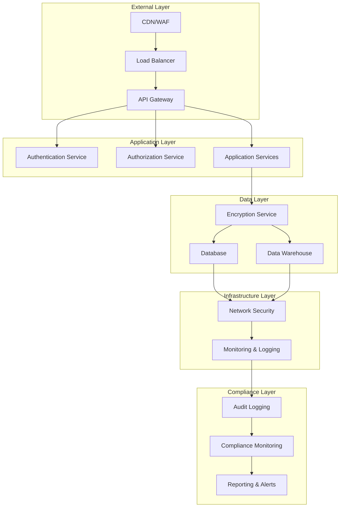

# 🛡️ IBIAS Security & Compliance Framework

**Document:** Enterprise Security & Compliance Architecture  
**Version:** 2.0 Enhanced  
**Compliance Standards:** SOC 2 Type II, GDPR, CCPA, ISO 27001  
**Last Updated:** 2024

---

## 🎯 Security Philosophy

**"Security by Design, Privacy by Default, Trust through Transparency"**

The IBIAS Security Framework is built on:
- 🔒 **Zero Trust Architecture**
- 🛡️ **Defense in Depth**
- 🔐 **End-to-End Encryption**
- 📊 **Continuous Monitoring**
- 🔍 **Proactive Threat Detection**
- 📋 **Compliance Automation**

---

## 🏗️ Security Architecture Overview



---

## 🔐 Authentication & Authorization

### 1. Multi-Factor Authentication (MFA)

**Enterprise-Grade Authentication:**
```typescript
interface AuthenticationConfig {
  primaryFactor: PrimaryAuthMethod;
  secondaryFactors: SecondaryAuthMethod[];
  biometricOptions: BiometricMethod[];
  sessionManagement: SessionConfig;
  riskAssessment: RiskAssessmentConfig;
}

class EnterpriseAuth {
  async authenticateUser(
    credentials: UserCredentials,
    context: AuthContext
  ): Promise<AuthResult> {
    
    // Risk-based authentication
    const riskScore = await this.assessRisk(credentials, context);
    
    // Adaptive MFA requirements
    const mfaRequirements = this.determineMFARequirements(riskScore, context);
    
    // Primary authentication
    const primaryResult = await this.validatePrimaryFactor(credentials);
    
    if (!primaryResult.success) {
      await this.logFailedAttempt(credentials, context);
      return { success: false, reason: 'Invalid credentials' };
    }
    
    // Secondary factor validation
    if (mfaRequirements.required) {
      const secondaryResult = await this.validateSecondaryFactors(
        credentials,
        mfaRequirements.factors
      );
      
      if (!secondaryResult.success) {
        return { success: false, reason: 'MFA validation failed' };
      }
    }
    
    // Generate secure session
    const session = await this.createSecureSession(credentials.userId, context);
    
    return {
      success: true,
      session,
      riskScore,
      mfaUsed: mfaRequirements.required
    };
  }
}
```

### 2. Role-Based Access Control (RBAC)

**Granular Permission System:**
```typescript
interface Permission {
  resource: string;
  action: string;
  conditions?: AccessCondition[];
  scope?: AccessScope;
}

interface Role {
  id: string;
  name: string;
  permissions: Permission[];
  hierarchy: RoleHierarchy;
  constraints: RoleConstraint[];
}

class RBACManager {
  async checkPermission(
    userId: string,
    resource: string,
    action: string,
    context: AccessContext
  ): Promise<AccessDecision> {
    
    // Get user roles
    const userRoles = await this.getUserRoles(userId);
    
    // Evaluate permissions
    const permissions = await this.evaluatePermissions(
      userRoles,
      resource,
      action,
      context
    );
    
    // Apply constraints
    const constraintResult = await this.applyConstraints(
      permissions,
      context
    );
    
    // Log access decision
    await this.logAccessDecision(userId, resource, action, constraintResult);
    
    return constraintResult;
  }
  
  private async evaluatePermissions(
    roles: Role[],
    resource: string,
    action: string,
    context: AccessContext
  ): Promise<PermissionEvaluation> {
    
    for (const role of roles) {
      for (const permission of role.permissions) {
        if (this.matchesResource(permission.resource, resource) &&
            this.matchesAction(permission.action, action)) {
          
          // Evaluate conditions
          if (permission.conditions) {
            const conditionResult = await this.evaluateConditions(
              permission.conditions,
              context
            );
            
            if (conditionResult.satisfied) {
              return { granted: true, permission, role };
            }
          } else {
            return { granted: true, permission, role };
          }
        }
      }
    }
    
    return { granted: false };
  }
}
```

### 3. Single Sign-On (SSO) Integration

**Enterprise SSO Support:**
```typescript
class SSOManager {
  async configureSAML(
    companyId: string,
    samlConfig: SAMLConfiguration
  ): Promise<SSOSetupResult> {
    
    // Validate SAML configuration
    const validation = await this.validateSAMLConfig(samlConfig);
    
    if (!validation.isValid) {
      return { success: false, errors: validation.errors };
    }
    
    // Set up SAML provider
    const provider = await this.createSAMLProvider(companyId, samlConfig);
    
    // Configure attribute mapping
    const attributeMapping = await this.configureAttributeMapping(
      samlConfig.attributeMapping
    );
    
    // Test SSO connection
    const testResult = await this.testSSOConnection(provider);
    
    if (testResult.success) {
      await this.activateSSOProvider(provider);
    }
    
    return {
      success: testResult.success,
      provider,
      testResult
    };
  }
}
```

---

## 🔒 Data Protection & Encryption

### 1. Encryption at Rest

**Advanced Encryption Standards:**
```typescript
interface EncryptionConfig {
  algorithm: EncryptionAlgorithm;
  keySize: number;
  keyRotationPeriod: Duration;
  keyManagement: KeyManagementStrategy;
}

class DataEncryption {
  async encryptSensitiveData(
    data: SensitiveData,
    classification: DataClassification
  ): Promise<EncryptedData> {
    
    // Determine encryption requirements
    const encryptionReq = this.getEncryptionRequirements(classification);
    
    // Generate or retrieve encryption key
    const encryptionKey = await this.getEncryptionKey(
      data.ownerId,
      encryptionReq.keyType
    );
    
    // Encrypt data with AES-256-GCM
    const encryptedData = await this.encrypt(
      data.content,
      encryptionKey,
      {
        algorithm: 'AES-256-GCM',
        additionalData: data.metadata
      }
    );
    
    // Store encryption metadata
    const encryptionMetadata = {
      keyId: encryptionKey.id,
      algorithm: 'AES-256-GCM',
      timestamp: new Date(),
      classification: classification
    };
    
    return {
      encryptedContent: encryptedData.ciphertext,
      iv: encryptedData.iv,
      authTag: encryptedData.authTag,
      metadata: encryptionMetadata
    };
  }
  
  async rotateEncryptionKeys(
    keyIds: string[]
  ): Promise<KeyRotationResult> {
    
    const results: KeyRotationResult[] = [];
    
    for (const keyId of keyIds) {
      try {
        // Generate new key
        const newKey = await this.generateEncryptionKey();
        
        // Re-encrypt data with new key
        const reencryptionResult = await this.reencryptData(keyId, newKey);
        
        // Update key references
        await this.updateKeyReferences(keyId, newKey.id);
        
        // Archive old key
        await this.archiveKey(keyId);
        
        results.push({
          oldKeyId: keyId,
          newKeyId: newKey.id,
          success: true,
          recordsUpdated: reencryptionResult.count
        });
        
      } catch (error) {
        results.push({
          oldKeyId: keyId,
          success: false,
          error: error.message
        });
      }
    }
    
    return { rotationResults: results };
  }
}
```

### 2. Encryption in Transit

**TLS 1.3 with Perfect Forward Secrecy:**
```typescript
class TransportSecurity {
  async configureTLS(): Promise<TLSConfiguration> {
    return {
      version: 'TLS 1.3',
      cipherSuites: [
        'TLS_AES_256_GCM_SHA384',
        'TLS_CHACHA20_POLY1305_SHA256',
        'TLS_AES_128_GCM_SHA256'
      ],
      certificateChain: await this.getCertificateChain(),
      hsts: {
        enabled: true,
        maxAge: 31536000, // 1 year
        includeSubDomains: true,
        preload: true
      },
      perfectForwardSecrecy: true,
      certificateTransparency: true
    };
  }
  
  async validateCertificate(
    certificate: X509Certificate
  ): Promise<CertificateValidation> {
    
    // Check certificate validity
    const validity = this.checkCertificateValidity(certificate);
    
    // Verify certificate chain
    const chainValidation = await this.verifyCertificateChain(certificate);
    
    // Check certificate revocation
    const revocationStatus = await this.checkRevocationStatus(certificate);
    
    // Validate certificate transparency
    const ctValidation = await this.validateCertificateTransparency(certificate);
    
    return {
      isValid: validity.isValid && chainValidation.isValid && 
               !revocationStatus.isRevoked && ctValidation.isValid,
      validityPeriod: validity.period,
      chainTrust: chainValidation.trustLevel,
      revocationStatus: revocationStatus.status,
      transparencyCompliance: ctValidation.compliance
    };
  }
}
```

### 3. Key Management

**Hardware Security Module (HSM) Integration:**
```typescript
class KeyManagement {
  async generateMasterKey(
    keySpec: KeySpecification
  ): Promise<MasterKey> {
    
    // Generate key in HSM
    const hsmKey = await this.hsm.generateKey({
      algorithm: keySpec.algorithm,
      keySize: keySpec.keySize,
      usage: keySpec.usage,
      extractable: false // Key never leaves HSM
    });
    
    // Create key metadata
    const keyMetadata = {
      id: this.generateKeyId(),
      algorithm: keySpec.algorithm,
      keySize: keySpec.keySize,
      createdAt: new Date(),
      usage: keySpec.usage,
      hsmKeyId: hsmKey.id,
      rotationSchedule: keySpec.rotationSchedule
    };
    
    // Store metadata (not the key itself)
    await this.storeKeyMetadata(keyMetadata);
    
    return {
      id: keyMetadata.id,
      metadata: keyMetadata,
      hsmReference: hsmKey.reference
    };
  }
  
  async performKeyOperation(
    keyId: string,
    operation: KeyOperation,
    data: Buffer
  ): Promise<Buffer> {
    
    // Retrieve key metadata
    const keyMetadata = await this.getKeyMetadata(keyId);
    
    // Validate operation permissions
    await this.validateKeyOperation(keyMetadata, operation);
    
    // Perform operation in HSM
    const result = await this.hsm.performOperation({
      keyReference: keyMetadata.hsmKeyId,
      operation: operation,
      data: data
    });
    
    // Log key usage
    await this.logKeyUsage(keyId, operation, {
      timestamp: new Date(),
      dataSize: data.length,
      success: true
    });
    
    return result;
  }
}
```

---

## 🔍 Security Monitoring & Threat Detection

### 1. Real-Time Security Monitoring

**SIEM Integration:**
```typescript
class SecurityMonitoring {
  async initializeMonitoring(): Promise<MonitoringSetup> {
    
    // Set up log aggregation
    const logAggregator = await this.setupLogAggregation({
      sources: [
        'application-logs',
        'access-logs',
        'security-logs',
        'audit-logs',
        'system-logs'
      ],
      retention: '7-years', // SOC 2 requirement
      encryption: true,
      realTimeProcessing: true
    });
    
    // Configure threat detection rules
    const threatDetection = await this.configureThreatDetection({
      rules: this.getSecurityRules(),
      mlModels: this.getAnomalyDetectionModels(),
      alertThresholds: this.getAlertThresholds()
    });
    
    // Set up incident response
    const incidentResponse = await this.setupIncidentResponse({
      escalationProcedures: this.getEscalationProcedures(),
      automatedResponses: this.getAutomatedResponses(),
      notificationChannels: this.getNotificationChannels()
    });
    
    return {
      logAggregator,
      threatDetection,
      incidentResponse
    };
  }
  
  async detectAnomalies(
    logEvents: LogEvent[]
  ): Promise<SecurityAnomaly[]> {
    
    const anomalies: SecurityAnomaly[] = [];
    
    // Behavioral analysis
    const behavioralAnomalies = await this.detectBehavioralAnomalies(logEvents);
    anomalies.push(...behavioralAnomalies);
    
    // Statistical analysis
    const statisticalAnomalies = await this.detectStatisticalAnomalies(logEvents);
    anomalies.push(...statisticalAnomalies);
    
    // Pattern matching
    const patternAnomalies = await this.detectPatternAnomalies(logEvents);
    anomalies.push(...patternAnomalies);
    
    // Machine learning detection
    const mlAnomalies = await this.detectMLAnomalies(logEvents);
    anomalies.push(...mlAnomalies);
    
    // Correlate and prioritize
    const correlatedAnomalies = await this.correlateAnomalies(anomalies);
    
    return this.prioritizeAnomalies(correlatedAnomalies);
  }
}
```

### 2. Intrusion Detection System (IDS)

**Advanced Threat Detection:**
```typescript
class IntrusionDetection {
  async analyzeNetworkTraffic(
    networkData: NetworkPacket[]
  ): Promise<ThreatAnalysis> {
    
    const threats: DetectedThreat[] = [];
    
    // Signature-based detection
    const signatureThreats = await this.signatureBasedDetection(networkData);
    threats.push(...signatureThreats);
    
    // Anomaly-based detection
    const anomalyThreats = await this.anomalyBasedDetection(networkData);
    threats.push(...anomalyThreats);
    
    // Behavioral analysis
    const behavioralThreats = await this.behavioralAnalysis(networkData);
    threats.push(...behavioralThreats);
    
    // Threat intelligence correlation
    const intelligenceThreats = await this.correlateWithThreatIntelligence(networkData);
    threats.push(...intelligenceThreats);
    
    // Risk assessment
    const riskAssessment = await this.assessThreatRisk(threats);
    
    return {
      threats,
      riskLevel: riskAssessment.overallRisk,
      recommendations: riskAssessment.recommendations,
      immediateActions: riskAssessment.immediateActions
    };
  }
  
  async respondToThreat(
    threat: DetectedThreat
  ): Promise<ThreatResponse> {
    
    // Determine response strategy
    const responseStrategy = this.determineResponseStrategy(threat);
    
    // Execute immediate containment
    const containmentResult = await this.executeContainment(
      threat,
      responseStrategy.containmentActions
    );
    
    // Notify security team
    await this.notifySecurityTeam(threat, containmentResult);
    
    // Update threat intelligence
    await this.updateThreatIntelligence(threat);
    
    // Generate incident report
    const incidentReport = await this.generateIncidentReport(
      threat,
      containmentResult
    );
    
    return {
      containmentSuccess: containmentResult.success,
      responseActions: responseStrategy.containmentActions,
      incidentId: incidentReport.id,
      followUpRequired: responseStrategy.requiresFollowUp
    };
  }
}
```

### 3. Vulnerability Management

**Continuous Security Assessment:**
```typescript
class VulnerabilityManagement {
  async performSecurityScan(
    scanScope: ScanScope
  ): Promise<SecurityScanResult> {
    
    // Infrastructure scanning
    const infraVulns = await this.scanInfrastructure(scanScope.infrastructure);
    
    // Application scanning
    const appVulns = await this.scanApplications(scanScope.applications);
    
    // Dependency scanning
    const depVulns = await this.scanDependencies(scanScope.dependencies);
    
    // Configuration scanning
    const configVulns = await this.scanConfigurations(scanScope.configurations);
    
    // Combine and prioritize vulnerabilities
    const allVulnerabilities = [
      ...infraVulns,
      ...appVulns,
      ...depVulns,
      ...configVulns
    ];
    
    const prioritizedVulns = await this.prioritizeVulnerabilities(allVulnerabilities);
    
    // Generate remediation plan
    const remediationPlan = await this.generateRemediationPlan(prioritizedVulns);
    
    return {
      vulnerabilities: prioritizedVulns,
      riskScore: this.calculateOverallRiskScore(prioritizedVulns),
      remediationPlan,
      complianceStatus: await this.assessComplianceStatus(prioritizedVulns)
    };
  }
  
  async trackRemediation(
    vulnerabilityId: string,
    remediationAction: RemediationAction
  ): Promise<RemediationResult> {
    
    // Record remediation attempt
    const remediationRecord = await this.recordRemediationAttempt(
      vulnerabilityId,
      remediationAction
    );
    
    // Verify remediation
    const verificationResult = await this.verifyRemediation(
      vulnerabilityId,
      remediationAction
    );
    
    // Update vulnerability status
    if (verificationResult.isSuccessful) {
      await this.updateVulnerabilityStatus(
        vulnerabilityId,
        'remediated'
      );
    }
    
    // Generate compliance report
    const complianceUpdate = await this.updateComplianceStatus(
      vulnerabilityId,
      verificationResult
    );
    
    return {
      success: verificationResult.isSuccessful,
      verificationDetails: verificationResult.details,
      complianceImpact: complianceUpdate,
      nextActions: verificationResult.isSuccessful ? [] : 
                   await this.getNextRemediationActions(vulnerabilityId)
    };
  }
}
```

---

## 📋 Compliance Framework

### 1. SOC 2 Type II Compliance

**Trust Service Criteria Implementation:**
```typescript
class SOC2Compliance {
  async implementSecurityCriteria(): Promise<SecurityControlsResult> {
    
    const controls: SecurityControl[] = [];
    
    // CC6.1 - Logical and Physical Access Controls
    controls.push(await this.implementAccessControls({
      logicalAccess: {
        mfa: true,
        rbac: true,
        sessionManagement: true,
        privilegedAccess: true
      },
      physicalAccess: {
        datacenterSecurity: true,
        biometricAccess: true,
        surveillanceMonitoring: true
      }
    }));
    
    // CC6.2 - System Access Controls
    controls.push(await this.implementSystemAccessControls({
      networkSegmentation: true,
      firewallConfiguration: true,
      intrusionDetection: true,
      vulnerabilityManagement: true
    }));
    
    // CC6.3 - Data Protection
    controls.push(await this.implementDataProtection({
      encryptionAtRest: true,
      encryptionInTransit: true,
      keyManagement: true,
      dataClassification: true
    }));
    
    // CC6.7 - System Monitoring
    controls.push(await this.implementSystemMonitoring({
      continuousMonitoring: true,
      logManagement: true,
      incidentResponse: true,
      threatDetection: true
    }));
    
    return {
      controls,
      complianceStatus: await this.assessSOC2Compliance(controls),
      auditReadiness: await this.assessAuditReadiness(controls)
    };
  }
  
  async generateSOC2Report(
    reportingPeriod: DateRange
  ): Promise<SOC2Report> {
    
    // Collect control evidence
    const controlEvidence = await this.collectControlEvidence(reportingPeriod);
    
    // Assess control effectiveness
    const controlAssessment = await this.assessControlEffectiveness(
      controlEvidence
    );
    
    // Identify exceptions
    const exceptions = await this.identifyExceptions(
      controlAssessment,
      reportingPeriod
    );
    
    // Generate management assertions
    const managementAssertions = await this.generateManagementAssertions(
      controlAssessment
    );
    
    return {
      reportingPeriod,
      controlEvidence,
      controlAssessment,
      exceptions,
      managementAssertions,
      overallOpinion: this.determineOverallOpinion(controlAssessment, exceptions)
    };
  }
}
```

### 2. GDPR Compliance

**Data Protection Regulation Implementation:**
```typescript
class GDPRCompliance {
  async implementDataProtectionRights(): Promise<DataRightsImplementation> {
    
    // Right to Access (Article 15)
    const accessRight = await this.implementAccessRight({
      dataPortability: true,
      responseTime: '30-days',
      dataFormats: ['JSON', 'CSV', 'PDF'],
      verificationProcess: true
    });
    
    // Right to Rectification (Article 16)
    const rectificationRight = await this.implementRectificationRight({
      selfServicePortal: true,
      verificationRequired: true,
      auditTrail: true,
      downstreamUpdates: true
    });
    
    // Right to Erasure (Article 17)
    const erasureRight = await this.implementErasureRight({
      rightToBeForgotten: true,
      dataRetentionPolicies: true,
      secureDataDestruction: true,
      thirdPartyNotification: true
    });
    
    // Right to Data Portability (Article 20)
    const portabilityRight = await this.implementPortabilityRight({
      structuredFormats: true,
      machineReadable: true,
      directTransfer: true,
      interoperableFormats: true
    });
    
    return {
      accessRight,
      rectificationRight,
      erasureRight,
      portabilityRight,
      complianceStatus: await this.assessGDPRCompliance()
    };
  }
  
  async processDataSubjectRequest(
    request: DataSubjectRequest
  ): Promise<DataSubjectResponse> {
    
    // Verify identity
    const identityVerification = await this.verifyDataSubjectIdentity(request);
    
    if (!identityVerification.verified) {
      return {
        success: false,
        reason: 'Identity verification failed',
        requestId: request.id
      };
    }
    
    // Process request based on type
    let response: DataSubjectResponse;
    
    switch (request.type) {
      case 'access':
        response = await this.processAccessRequest(request);
        break;
      case 'rectification':
        response = await this.processRectificationRequest(request);
        break;
      case 'erasure':
        response = await this.processErasureRequest(request);
        break;
      case 'portability':
        response = await this.processPortabilityRequest(request);
        break;
      case 'objection':
        response = await this.processObjectionRequest(request);
        break;
      default:
        response = {
          success: false,
          reason: 'Unsupported request type',
          requestId: request.id
        };
    }
    
    // Log request processing
    await this.logDataSubjectRequest(request, response);
    
    return response;
  }
}
```

### 3. Audit Logging & Compliance Monitoring

**Comprehensive Audit Trail:**
```typescript
class AuditLogging {
  async logSecurityEvent(
    event: SecurityEvent
  ): Promise<AuditLogEntry> {
    
    // Create audit log entry
    const auditEntry: AuditLogEntry = {
      id: this.generateAuditId(),
      timestamp: new Date(),
      eventType: event.type,
      userId: event.userId,
      sessionId: event.sessionId,
      sourceIP: event.sourceIP,
      userAgent: event.userAgent,
      resource: event.resource,
      action: event.action,
      outcome: event.outcome,
      riskLevel: event.riskLevel,
      additionalData: event.additionalData,
      hash: await this.calculateEntryHash(event)
    };
    
    // Encrypt sensitive data
    const encryptedEntry = await this.encryptAuditEntry(auditEntry);
    
    // Store in tamper-evident log
    await this.storeAuditEntry(encryptedEntry);
    
    // Real-time monitoring
    await this.processRealTimeMonitoring(auditEntry);
    
    // Compliance reporting
    await this.updateComplianceMetrics(auditEntry);
    
    return auditEntry;
  }
  
  async generateComplianceReport(
    framework: ComplianceFramework,
    reportingPeriod: DateRange
  ): Promise<ComplianceReport> {
    
    // Retrieve relevant audit logs
    const auditLogs = await this.getAuditLogs(reportingPeriod);
    
    // Analyze compliance metrics
    const complianceMetrics = await this.analyzeComplianceMetrics(
      auditLogs,
      framework
    );
    
    // Identify compliance gaps
    const complianceGaps = await this.identifyComplianceGaps(
      complianceMetrics,
      framework
    );
    
    // Generate recommendations
    const recommendations = await this.generateComplianceRecommendations(
      complianceGaps
    );
    
    // Create executive summary
    const executiveSummary = await this.createExecutiveSummary(
      complianceMetrics,
      complianceGaps,
      recommendations
    );
    
    return {
      framework,
      reportingPeriod,
      complianceMetrics,
      complianceGaps,
      recommendations,
      executiveSummary,
      overallComplianceScore: this.calculateComplianceScore(complianceMetrics)
    };
  }
}
```

---

## 🚨 Incident Response

### 1. Incident Detection & Classification

**Automated Incident Response:**
```typescript
class IncidentResponse {
  async detectIncident(
    securityEvent: SecurityEvent
  ): Promise<IncidentDetectionResult> {
    
    // Analyze event severity
    const severity = await this.analyzeSeverity(securityEvent);
    
    // Correlate with other events
    const correlation = await this.correlateEvents(securityEvent);
    
    // Classify incident type
    const classification = await this.classifyIncident(
      securityEvent,
      correlation
    );
    
    // Determine if incident threshold is met
    const isIncident = this.meetsIncidentThreshold(
      severity,
      classification,
      correlation
    );
    
    if (isIncident) {
      // Create incident record
      const incident = await this.createIncident({
        triggerEvent: securityEvent,
        severity,
        classification,
        correlatedEvents: correlation.events
      });
      
      // Initiate response
      await this.initiateIncidentResponse(incident);
      
      return {
        incidentDetected: true,
        incident,
        responseInitiated: true
      };
    }
    
    return {
      incidentDetected: false,
      eventProcessed: true
    };
  }
  
  async executeIncidentResponse(
    incident: SecurityIncident
  ): Promise<IncidentResponseResult> {
    
    // Immediate containment
    const containmentResult = await this.executeContainment(incident);
    
    // Evidence collection
    const evidenceCollection = await this.collectEvidence(incident);
    
    // Impact assessment
    const impactAssessment = await this.assessImpact(incident);
    
    // Stakeholder notification
    const notificationResult = await this.notifyStakeholders(
      incident,
      impactAssessment
    );
    
    // Recovery planning
    const recoveryPlan = await this.createRecoveryPlan(
      incident,
      impactAssessment
    );
    
    // Execute recovery
    const recoveryResult = await this.executeRecovery(recoveryPlan);
    
    // Post-incident analysis
    const postIncidentAnalysis = await this.conductPostIncidentAnalysis(
      incident,
      recoveryResult
    );
    
    return {
      containmentSuccess: containmentResult.success,
      evidenceCollected: evidenceCollection.success,
      impactAssessment,
      stakeholdersNotified: notificationResult.success,
      recoverySuccess: recoveryResult.success,
      lessonsLearned: postIncidentAnalysis.lessonsLearned,
      improvementActions: postIncidentAnalysis.improvementActions
    };
  }
}
```

### 2. Business Continuity & Disaster Recovery

**Resilience Planning:**
```typescript
class BusinessContinuity {
  async createDisasterRecoveryPlan(): Promise<DisasterRecoveryPlan> {
    
    // Business impact analysis
    const businessImpactAnalysis = await this.conductBusinessImpactAnalysis();
    
    // Risk assessment
    const riskAssessment = await this.conductRiskAssessment();
    
    // Recovery strategies
    const recoveryStrategies = await this.developRecoveryStrategies(
      businessImpactAnalysis,
      riskAssessment
    );
    
    // Recovery procedures
    const recoveryProcedures = await this.createRecoveryProcedures(
      recoveryStrategies
    );
    
    // Testing plan
    const testingPlan = await this.createTestingPlan(recoveryProcedures);
    
    return {
      businessImpactAnalysis,
      riskAssessment,
      recoveryStrategies,
      recoveryProcedures,
      testingPlan,
      rto: businessImpactAnalysis.recoveryTimeObjective,
      rpo: businessImpactAnalysis.recoveryPointObjective
    };
  }
  
  async executeDisasterRecovery(
    disasterType: DisasterType
  ): Promise<DisasterRecoveryResult> {
    
    // Activate disaster recovery plan
    const activationResult = await this.activateDisasterRecoveryPlan(disasterType);
    
    // Execute recovery procedures
    const recoveryResults = await this.executeRecoveryProcedures(
      activationResult.procedures
    );
    
    // Validate recovery
    const validationResult = await this.validateRecovery(recoveryResults);
    
    // Communicate status
    await this.communicateRecoveryStatus(validationResult);
    
    // Monitor recovery
    const monitoringResult = await this.monitorRecovery(validationResult);
    
    return {
      activationSuccess: activationResult.success,
      recoverySuccess: recoveryResults.success,
      validationSuccess: validationResult.success,
      rtoAchieved: validationResult.rtoAchieved,
      rpoAchieved: validationResult.rpoAchieved,
      monitoringActive: monitoringResult.active
    };
  }
}
```

---

## 📊 Security Metrics & KPIs

### 1. Security Performance Indicators

**Comprehensive Security Metrics:**
```typescript
interface SecurityMetrics {
  // Authentication & Access
  authenticationSuccessRate: number;
  mfaAdoptionRate: number;
  privilegedAccessUsage: number;
  sessionSecurityScore: number;
  
  // Threat Detection
  threatDetectionAccuracy: number;
  falsePositiveRate: number;
  meanTimeToDetection: number;
  meanTimeToResponse: number;
  
  // Vulnerability Management
  vulnerabilityDiscoveryRate: number;
  criticalVulnerabilityAge: number;
  patchingEfficiency: number;
  securityDebtScore: number;
  
  // Compliance
  complianceScore: number;
  auditFindingsCount: number;
  policyViolationRate: number;
  dataProtectionScore: number;
  
  // Incident Response
  incidentResponseTime: number;
  incidentResolutionRate: number;
  businessImpactScore: number;
  recoveryTimeActual: number;
}

class SecurityMetricsCollector {
  async collectSecurityMetrics(
    timeRange: TimeRange
  ): Promise<SecurityMetrics> {
    
    // Authentication metrics
    const authMetrics = await this.collectAuthenticationMetrics(timeRange);
    
    // Threat detection metrics
    const threatMetrics = await this.collectThreatDetectionMetrics(timeRange);
    
    // Vulnerability metrics
    const vulnMetrics = await this.collectVulnerabilityMetrics(timeRange);
    
    // Compliance metrics
    const complianceMetrics = await this.collectComplianceMetrics(timeRange);
    
    // Incident response metrics
    const incidentMetrics = await this.collectIncidentResponseMetrics(timeRange);
    
    return {
      ...authMetrics,
      ...threatMetrics,
      ...vulnMetrics,
      ...complianceMetrics,
      ...incidentMetrics
    };
  }
}
```

---

## 🔧 Implementation Roadmap

### Phase 1: Foundation Security (Weeks 1-4)
- ✅ Basic authentication and authorization
- ✅ Data encryption at rest and in transit
- ✅ Basic audit logging
- ✅ Network security configuration

### Phase 2: Advanced Security (Weeks 5-8)
- 🔄 Multi-factor authentication
- 🔄 Advanced threat detection
- 🔄 Vulnerability management
- 🔄 Incident response procedures

### Phase 3: Compliance (Weeks 9-12)
- 🔄 SOC 2 controls implementation
- 🔄 GDPR compliance features
- 🔄 Comprehensive audit trails
- 🔄 Compliance monitoring

### Phase 4: Enterprise Security (Weeks 13-16)
- 🔄 Advanced monitoring and analytics
- 🔄 Automated incident response
- 🔄 Business continuity planning
- 🔄 Security metrics dashboard

### Phase 5: Continuous Improvement (Weeks 17-20)
- 🔄 Security optimization
- 🔄 Compliance certification
- 🔄 Penetration testing
- 🔄 Security awareness training

---

## 📋 Summary

The IBIAS Security & Compliance Framework provides:

✅ **Enterprise-Grade Security:** Zero-trust architecture with defense in depth  
✅ **Comprehensive Compliance:** SOC 2, GDPR, CCPA, and ISO 27001 ready  
✅ **Advanced Threat Protection:** Real-time monitoring and automated response  
✅ **Data Protection:** End-to-end encryption and privacy by design  
✅ **Continuous Monitoring:** 24/7 security operations and compliance tracking  
✅ **Incident Response:** Automated detection and response capabilities  

This framework ensures that IBIAS meets the highest security and compliance standards while maintaining operational efficiency and user experience.

> **Mission:** To provide uncompromising security and compliance that enables business growth while protecting customer data and maintaining regulatory compliance.

---

*This document serves as the definitive guide for implementing and maintaining enterprise-grade security and compliance for the IBIAS platform.*